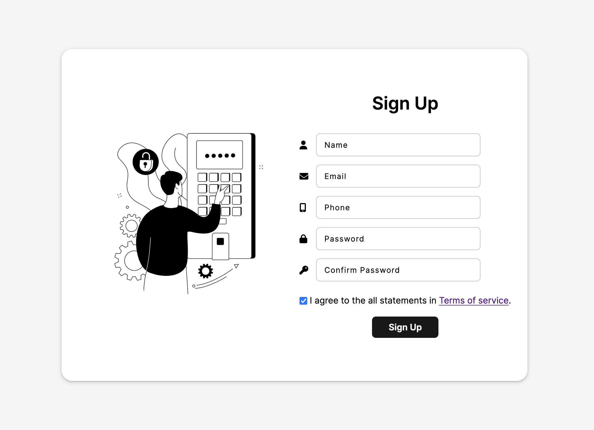

# Sign Up Form

This project was created as a part of The Odin Project curriculum. I used HTML, CSS, and JS with AOS library to add some animations. 

## Some features
* Inputs validation was made in HTML (except checking passwords matching)
* Form changes input's border color in real time if passwords match or not
* Animated floating labels
* User can't submit the form if he didn't agree with the Terms of Service

